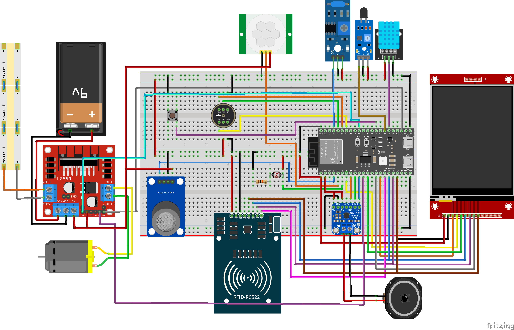
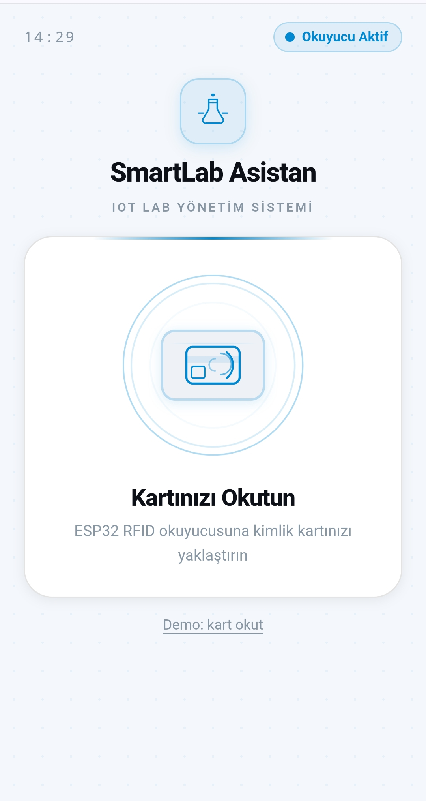
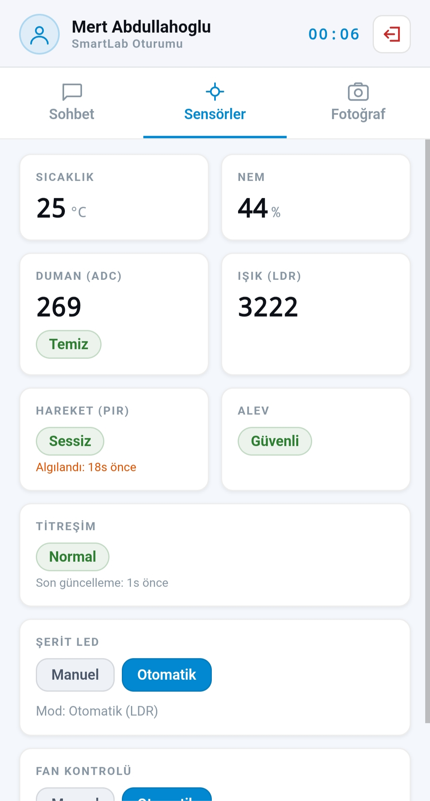
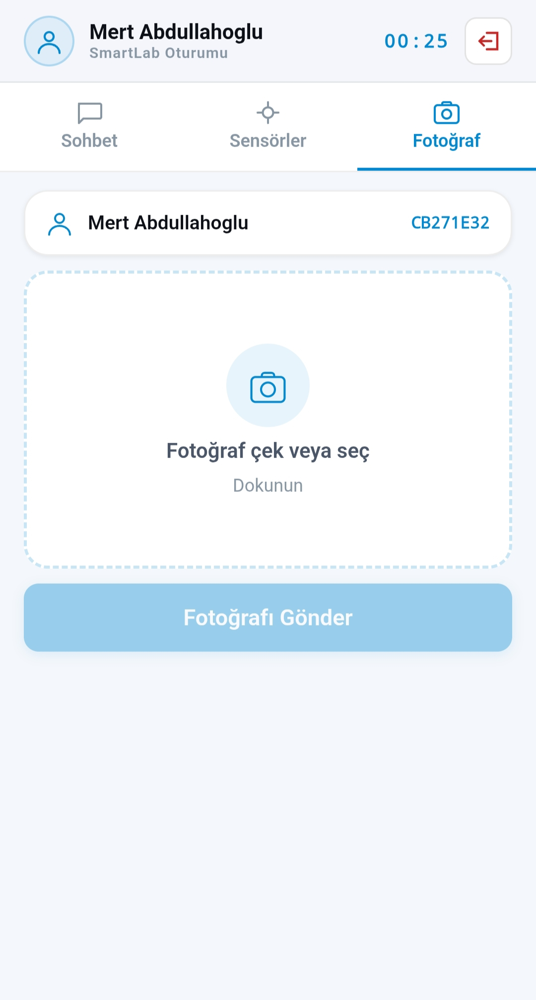
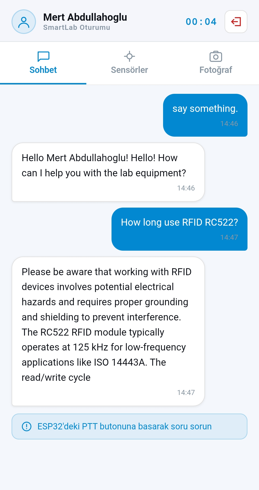

<div align="center">
  <h1>🧠 ESP32 SmartLab Asistanı (SmartLab Assistant)</h1>
  <p><strong>Yapay Zeka Destekli, Uçtan Uca Şifreli, Çoklu Sensörlü Akıllı Laboratuvar Sistemi</strong></p>
  <p>
    <a href="#english">🇬🇧 English</a> | <a href="#turkce">🇹🇷 Türkçe</a>
  </p>
</div>

---

<a id="english"></a>

## 🇬🇧 English

### 📖 About The Project

This project is an advanced **SmartLab Assistant** running on the **ESP32** microcontroller. It serves as a secure, voice-controlled IoT hub that monitors laboratory environments and interacts with users via **Local Large Language Models (LLM)** and **RAG (Retrieval-Augmented Generation)**. It features real-time sensor data streaming, AES-256 encrypted WebSocket communication, and a comprehensive Web UI for remote monitoring and control.

### ✨ Key Features

- **🗣️ Voice Interaction (STT & TTS):** Captures audio via I2S microphone (INMP441), streams it securely, and plays back LLM responses via I2S amplifier (MAX98357A).
- **🧠 AI & RAG Integration:** Processes voice commands using a local LLM (Ollama) and answers questions based on local PDF documents using RAG (Langchain).
- **🛡️ Secure Access & Encryption:** Uses MFRC522 RFID for user authentication. All audio data over WebSockets is encrypted using AES-256-CBC.
- **🌡️ Multi-Sensor Environment Monitoring:** Tracks Temperature & Humidity (DHT11), Air Quality/Smoke (MQ135), Light (LDR), Motion (PIR), Flame, and Vibration (SW-420).
- **⚙️ Automated Actuators:** Controls an exhaust Fan (PWM) and LED Strips automatically based on environmental thresholds or manual Web UI overrides.
- **🌐 Real-Time Web Dashboard:** A sleek Web UI to monitor live sensor telemetry, control actuators, and view chat history.

### 🛠️ Architecture & Technologies

- **Hardware:** ESP32, INMP441, MAX98357A, ILI9341 LCD, MFRC522 RFID, MQ135, DHT11, LDR, PIR, Flame, SW-420, L298N Motor Driver.
- **Embedded:** C, ESP-IDF (v5.x), FreeRTOS.
- **Server & Backend:** Python 3.10+, FastAPI, WebSockets, Piper TTS, Ollama (Local LLM), Langchain (RAG), ChromaDB.
- **Frontend:** HTML, CSS, JavaScript (Vanilla).

### 🖼️ Circuit Diagram

Below is the circuit diagram showing the hardware components and connections of the project. This diagram was prepared using **Fritzing**.



### 🖥️ Web Dashboard Screenshots

Below are the screenshots of the Web UI used for live telemetry and environment control.

<p align="center">
  
  
  
  
</p>

---

### 🚀 Getting Started

**Important Note:** Before building the project, update `main/config.h` with your Wi-Fi credentials (`WIFI_SSID`, `WIFI_PASSWORD`) and the local IP address of your server (`SERVER_HOST`).

#### 1. Ollama & Backend Setup

1. Download and install Ollama from [Ollama.com](https://ollama.com).
2. Pull the required models:
   
   ```bash
   ollama run gemma3:4b
   ollama pull nomic-embed-text
   ```
   
   *Note: If your Python server and Ollama are on different machines, or if you face connection issues, you must set `OLLAMA_HOST="0.0.0.0"` in your system environment variables before starting Ollama to allow external connections.*

#### 2. Python Server Setup

The backend handles LLM interaction, RAG, TTS, and Web UI hosting.

```bash
cd server
pip install -r requirements.txt
```

#### 3. Models & Dependencies (Manual Downloads)

For the TTS feature to work on Windows, the Piper binaries and voice models must be manually downloaded and placed in the `server` directory:

- **Piper TTS (Windows):** Download `piper.exe` and necessary DLLs from [Piper GitHub Releases](https://github.com/rhasspy/piper/releases) and extract them into the `server` folder.
- **Models (ONNX):** Download `tr_TR-dfki-medium` (for Turkish) or `en_GB-alba-medium` (for English) `.onnx` and `.onnx.json` files from [Piper Voices](https://huggingface.co/rhasspy/piper-voices/tree/main) and place them inside `server/tts_models/`.

#### 4. Running the Server

Once all dependencies and models are in place, you can start the backend server.

```bash
# Start the FastAPI server (Host Web UI and WebSocket)
uvicorn main:app --host 0.0.0.0 --port 8080
```

*Note: Place your PDF files in the `rag_pdf` folder for the RAG system to index them on startup.*  
*Access the Web UI by opening your browser and navigating to: **`http://localhost:8080`** (or the server's IP address).*

#### 5. ESP32 Setup (Firmware Build & Flash)

```bash
# Activate ESP-IDF environment
get_idf

# Build the project
idf.py build

# Flash code to ESP32 and open serial monitor
idf.py -p COMX flash monitor
```

### 🎮 How to Use

1. **Voice Assistant:** Press and hold the **PTT (Push-To-Talk)** button on the device to speak. Release the button to send your audio to the server. The AI will generate a response, and the ESP32 will play it back loudly.
2. **Web Dashboard:** Use the Web UI to monitor live sensor telemetry, view the conversation history, or manually control the LED and Fan.
3. **RFID Authentication:** Present your authorized RFID card to unlock and access the system.

### 👥 Developers

This project was developed within the scope of the **Internet of Things** course at the **Computer Engineering Department of Recep Tayyip Erdogan University**, under the supervision of **Assoc. Prof. Yıldıran Yılmaz**.

- **Mert Abdullahoğlu**
- **Abdül Samed Kara**

---

<br><hr><br>

<a id="turkce"></a>

## 🇹🇷 Türkçe

### 📖 Proje Hakkında

Bu proje, **ESP32** mikrodenetleyicisi üzerinde koşan gelişmiş bir **Akıllı Laboratuvar (SmartLab) Asistanı**'dır. Laboratuvar ortamını sürekli izleyen, kullanıcılarla sesli etkileşime giren, **Yerel Büyük Dil Modelleri (LLM)** ve **RAG (Geri Getirmeyle Güçlendirilmiş Üretim)** teknolojilerini kullanan uçtan uca şifreli bir IoT merkezidir. Gerçek zamanlı sensör telemetrisi ve web tabanlı bir kontrol paneli sunar.

### ✨ Temel Özellikler

- **🗣️ Sesli Etkileşim (STT & TTS):** I2S mikrofon ile sesi yakalar, şifreli yollar ve dönen metinsel LLM yanıtlarını I2S hoparlör üzerinden yüksek kalitede seslendirir.
- **🧠 Yapay Zeka & RAG:** Sesli komutlar yerel LLM (Ollama) ile işlenir. Yüklenen PDF dokümanları içerisinden RAG (Langchain) mantığıyla bağlamsal cevaplar üretilir.
- **🛡️ Güvenli Erişim ve Şifreleme:** Sisteme giriş MFRC522 RFID kart okuyucu ile yapılır. Ağ üzerinden geçen tüm ses verileri **AES-256-CBC** ile şifrelenir.
- **🌡️ Çoklu Sensör Takibi:** Sıcaklık ve Nem (DHT11), Hava Kalitesi/Duman (MQ135), Işık (LDR), Hareket (PIR), Alev ve Titreşim (SW-420) anlık takip edilir.
- **⚙️ Otomatik Aktüatörler:** Ortam koşullarına göre (sıcaklık, duman, ışık) Fan ve Şerit LED sistemleri otomatik çalışır veya Web UI üzerinden manuel yönetilebilir.
- **🌐 Gerçek Zamanlı Web Paneli:** Canlı sensör verilerini, sistem durumunu ve sohbet geçmişini izlemek için şık bir arayüz.

### 🛠️ Mimari ve Teknolojiler

- **Donanım:** ESP32, INMP441, MAX98357A, ILI9341 LCD, MFRC522 RFID, MQ135, DHT11, LDR, PIR, Alev Sensörü, SW-420 Titreşim Sensörü, L298N.
- **Gömülü Yazılım:** C, ESP-IDF (v5.x), FreeRTOS.
- **Sunucu ve Backend:** Python 3.10+, FastAPI, WebSockets, Piper TTS, Ollama (Local LLM), Langchain (RAG), ChromaDB.
- **Frontend:** HTML, CSS, JavaScript (Vanilla).

### 🖼️ Devre Şeması

Aşağıda projenin donanım bileşenlerini ve bağlantılarını gösteren devre şeması yer almaktadır. Bu şema **Fritzing** kullanılarak hazırlanmıştır.


### 🖥️ Web Paneli Ekran Görüntüleri

Sistemi uzaktan izlemek, sensör verilerini anlık takip etmek ve cihazları kontrol etmek için kullanılan Web Arayüzüne ait ekran görüntüleri:

<p align="center">
  
  
  
  
</p>

---

### 🚀 Kurulum ve Çalıştırma

**Önemli Not:** Projeyi derlemeden önce `main/config.h` dosyasını açarak yerleşik olan değerlerin (`WIFI_SSID`, `WIFI_PASSWORD`, `SERVER_HOST`) yerine kendi Wi-Fi bilgilerinizi ve sunucu bilgisayarınızın yerel IP adresini girdiğinizden emin olun.

#### 1. Ollama ve Yapay Zeka Kurulumu

1. [Ollama.com](https://ollama.com) adresinden Ollama'yı kurun.
2. Gerekli modelleri terminalden çekin:
   
   ```bash
   ollama run gemma3:4b
   ollama pull nomic-embed-text
   ```
   
   *Not: Eğer Python sunucunuz ile Ollama farklı bilgisayarlarda çalışacaksa veya bağlantı reddedildi hatası alırsanız, Ollama'yı başlatmadan önce sistem ortam değişkenlerine `OLLAMA_HOST="0.0.0.0"` ekleyerek dış bağlantılara izin vermeniz gerekir.*

#### 2. Python Sunucusu Kurulumu

Backend sistemi LLM, RAG, TTS işlemlerini ve Web Arayüzünü sunar.

```bash
cd server
pip install -r requirements.txt
```

#### 3. Gerekli Model ve Bağımlılık Dosyaları (Manuel Kurulum)

Projenin TTS (Seslendirme) özelliğinin Windows üzerinde sorunsuz çalışabilmesi için şu dosyaların manuel olarak indirilip `server` klasörüne yerleştirilmesi gerekir:

- **Piper TTS (Windows):** [Piper GitHub Releases](https://github.com/rhasspy/piper/releases) üzerinden Windows sürümünü indirin; içindeki `piper.exe` ve tüm `.dll` dosyalarını `server` klasörünün ana dizinine kopyalayın.
- **Modeller (ONNX):** [Piper Voices](https://huggingface.co/rhasspy/piper-voices/tree/main) üzerinden Türkçe için `tr_TR-dfki-medium` (veya İngilizce için `en_GB-alba-medium`) `.onnx` ve `.onnx.json` dosyalarını indirip `server/tts_models/` klasörüne yerleştirin.

#### 4. Sunucuyu Başlatma

Tüm bağımlılıklar ve model dosyaları yerleştirildikten sonra sunucuyu çalıştırabilirsiniz.

```bash
# FastAPI Sunucusunu Başlatın
uvicorn main:app --host 0.0.0.0 --port 8080
```

*Not: RAG sisteminin referans alacağı PDF dokümanlarınızı `rag_pdf` klasörüne eklemeyi unutmayın.*  
*Web paneline erişmek için tarayıcınızdan şu adrese gidin: **`http://localhost:8080`** (veya sunucunun IP adresi).*

#### 5. ESP32 Kurulumu (Firmware Build & Flash)

```bash
# ESP-IDF ortamını aktif edin (Örn: get_idf)
get_idf

# Projeyi derleyin
idf.py build

# ESP32'ye kodu yükleyin ve seri monitörü başlatın 
idf.py -p COMX flash monitor
```

### 🎮 Nasıl Kullanılır?

1. **Sesli Asistan:** Cihaz üzerindeki **PTT (Bas-Konuş)** butonuna basılı tutarak konuşun. Butonu bıraktığınızda sesiniz sunucuya iletilecek, yapay zeka cevap üretecek ve cihaz size sesli olarak yanıt verecektir.
2. **Web Paneli:** Canlı sensör verilerini izlemek, sohbet geçmişini okumak veya Fan/LED gibi cihazları manuel kontrol etmek için tarayıcınızdan Web arayüzüne girin.
3. **RFID Girişi:** Sistemin kilidini açmak ve etkileşime girmek için yetkili RFID kartınızı okutun.

### 👥 Geliştiriciler

Bu proje, **Recep Tayyip Erdoğan Üniversitesi Bilgisayar Mühendisliği** bölümünde **Nesnelerin İnterneti (Internet of Things)** dersi kapsamında, **Doç. Dr. Yıldıran Yılmaz** danışmanlığında hazırlanmıştır.

- **Mert Abdullahoğlu**
- **Abdül Samed Kara**
